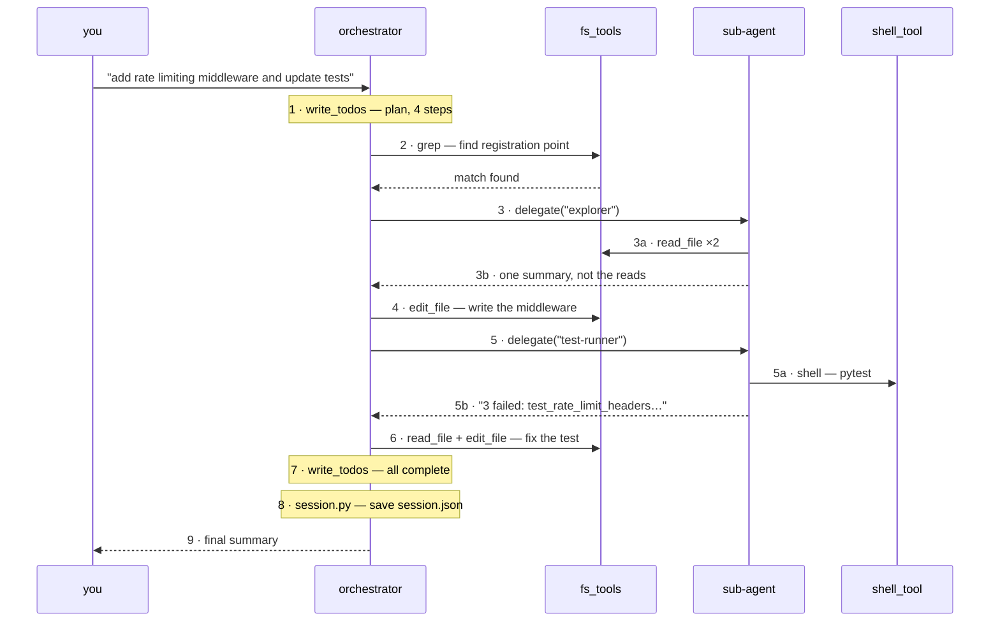
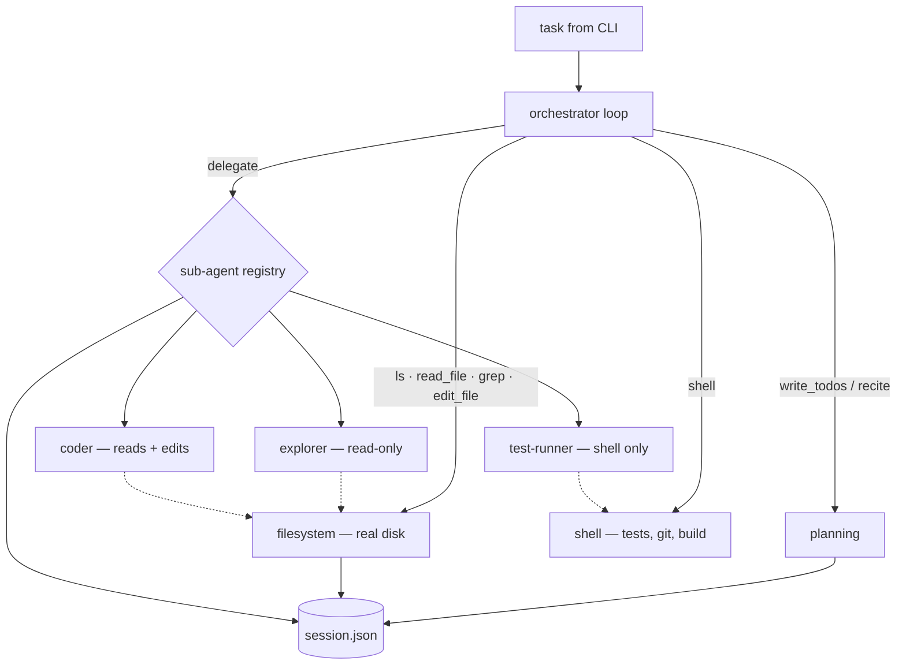

# Nanocode — architecture

An interactive CLI coding agent — run it, ask for something, keep asking. It
plans with a todo list, reads and edits real files on disk, runs shell commands,
and delegates isolated sub-tasks to sub-agents with wiped context. The four
techniques from `deep-agents-from-scratch` — planning, filesystem offload,
sub-agent isolation, prompting — applied to a real repository instead of a
virtual filesystem.

## Sessions: one loop, many asks

The task loop below runs once per ask. A **session** is that loop firing again
each time you ask for something new, without restarting:

```
build_orchestrator()          ← once, at startup
   │
   ├── ask 1 ──▶ plan → work → summary
   ├── ask 2 ──▶ plan → work → summary     (sees everything ask 1 did)
   └── ask 3 ──▶ …
```

One orchestrator instance serves the whole session, and an `InMemorySaver`
checkpointer keyed to a single thread id carries the conversation between asks.
That's what makes "now cover it with a test" resolve `it` without the user
re-explaining — turn two is handed turn one's messages, not a cold start.

Three consequences worth naming:

- **`session_log` is append-only across the session**, so the session file holds
  the whole record — but the summary printed after each ask is sliced to that
  ask alone. The session doesn't end when a task does; that task does.
- **A failed ask ends the ask, not the session.** The exception is surfaced and
  the prompt comes back, so a provider hiccup doesn't cost you the context.
- **`--once` is not a second code path.** It runs the same loop and skips the
  prompt-again step — for CI and scripting.

### Commands act on the session, not through it

`/model`, `/clear` and `/help` are handled before the ask reaches the model.
Routing them through the agent would mean asking a model to reason about the
machinery it is running inside, and would put both behind a token cost for no
benefit. An unknown `/word` still falls through to the model, so "/health should
return 200" remains a task you can type.

Two of them are only interesting because of what they preserve:

- **`/clear` rotates the thread id.** `session_log` has an `operator.add`
  reducer, so assigning `[]` to it appends nothing — a new thread is the only
  honest reset. Constraints survive, because dropping the user's standing rules
  on a *context* clear is the most annoying available reading of the word.
- **`/model` rebuilds the graph around the same checkpointer and thread**, so a
  switch costs nothing in context. That is the point of having it: reach for a
  bigger model on the hard step, not the hard session.

The model list is fetched from the provider rather than hardcoded, and failure
raises instead of falling back — a stale list is worse than no list, because it
looks authoritative and hides the model you wanted.

## How a task flows through the system



Five things worth noticing:

- **The plan is rewritten, not appended to.** Every "check the step off" also
  lets the orchestrator reorder or add steps as it learns about the codebase.
- **A tool call and a delegation look identical from the orchestrator's side** —
  both return one message. It never sees a sub-agent's intermediate steps.
- **The sub-agent branch is a full copy of the same loop**, with a shorter
  memory. It can call tools, fail, and retry, all invisible to the parent.
- **Nothing about this loop depends on task size.** Only the plan and the disk
  grow — never the amount the model holds in its head at once.
- **The final result isn't the end of the trail.** The plan and a log of what
  happened are already on disk, which is what makes resuming possible.

## Architecture



The dotted lines matter: because the filesystem is real rather than an
in-memory dict, a sub-agent's edits are visible to the orchestrator the moment
they happen — nothing has to be copied back through graph state.

## State

There is no `files` field — the disk already persists that. What remains is
three durable things, which together are enough to resume without a transcript.

```python
class NanocodeState(AgentState):
    todos: NotRequired[list[Todo]]
    session_log: NotRequired[Annotated[list[Event], operator.add]]
    constraints: NotRequired[list[str]]
```

| field | | scope |
| --- | --- | --- |
| `todos` | intent — what to do, and how far along | one run |
| `session_log` | evidence — what actually happened | one run |
| `constraints` | standing orders | the project |

The first two answer *where is this task*. The third answers *what is always
true here*, which is a different question with a different lifetime — hence a
different file.

### Constraints, and why they are state rather than conversation

A user says "never touch the auth module" once and expects it to hold. Left in
the message list, that rule dies twice: when the process exits, and again when
compaction trims the turn it was said in. The second death is the worse one,
because it happens silently inside a session the user believes is still going.

So a constraint gets the same treatment as the plan — written to disk the
moment it is stated, and re-injected into every model call thereafter. It is
never trimmed, and compaction cannot reach it: however much history is thrown
away, `recite_context` rebuilds it from state on the very next call.

This is the deep-agents move applied to intent rather than to data. Offload put
file contents on disk because context is scarce; constraints go on disk for the
same reason, and gain durability as a side effect. The file is plain markdown
(`- one rule per line`) so it can be written by hand before the agent runs —
at which point it is doing the job `CLAUDE.md` does for Claude Code.

The prompt draws the line: "fix the failing test" is a todo, "always run the
tests before finishing" is a constraint. If it stops mattering when the task is
done, it is not a constraint.

## Planning, and why recitation is structural

The tutorial recites the plan by *instructing* the model to re-read it, which
is easy to forget on a long run. Nanocode re-injects the plan — and the standing
constraints — before every model call from `recite_context` middleware, so
neither can be forgotten and neither has to survive in the message list.

`write_todos` still overwrites the whole list on every call — the model needs to
freely re-prioritize as it learns more about the codebase.

### Compaction

Recitation and filesystem offload slow the growth of the message list; they
don't cap it. `compact_if_needed` runs every turn and acts only when **two**
conditions hold:

1. Token usage crosses 90% of the model's context window, **and**
2. the run is at a clean checkpoint — every issued tool call already produced
   its result.

Collapsing mid-step would drop the reasoning behind an action nothing durable
has recorded yet. Waiting one extra turn is what makes the digest's claim — "the
current state is in `todos` and `session_log`" — true rather than aspirational.
The cut point is also moved forward past any `ToolMessage` so compaction can
never orphan a tool result from the call that requested it.

## Filesystem

Five signatures over two interchangeable backends: `VirtualFileSystem` (an
in-memory dict, used by the tests — nothing can touch a real machine) and
`DiskFileSystem` (the real repo, sandboxed). The agent logic is written once,
against the interface.

- **Pagination on `read_file` is load-bearing**, not illustrative: a 3,000-line
  file must never fully enter context just because the model asked to see it.
- **`edit_file` errors unless `old_string` is unique**, which forces a precise
  match instead of a whole-file rewrite.
- **Filesystem errors come back as tool output, never exceptions.** One bad path
  from the model would otherwise tear down the entire run.

## Decisions

The memo's four open questions, as resolved:

| Question | Decision | Why |
| --- | --- | --- |
| Framework | Hand-rolled `create_agent` | `recite_todos` and `compact_if_needed` are the central design points, and the packaged option doesn't expose middleware hooks for them. |
| Sandbox strictness | Hard-block outside the project root | No escape hatch, no confirmation prompt. Simplest to reason about and to trust once `coder` sub-agents can write. Symlinks are resolved before the check. |
| Shell for `coder` | No | Keeps the blast radius of an isolated sub-agent small, and keeps "should we run the tests now" a decision the orchestrator makes. |
| Terminal UI | `rich` live panel | Live plan panel, diff summary, indented sub-agent trace — with an automatic fallback to plain lines when stdout is not a TTY, and to ASCII glyphs when the console encoding can't represent them. |

## Sub-agents

`delegate()` wipes the message history — one task string in, nothing else. It
does **not** wipe the sub-agent's system prompt, its access to the shared disk,
or the model. There is no memory between calls either: delegating to `explorer`
twice produces two sub-agents that have never met, even though they share a
name. Anything the first learns must reach the second through a file.

| Type | Tools | Used for |
| --- | --- | --- |
| `explorer` | grep, glob, read_file, ls, web_search | "find where X is defined", "what's the current API for Y" — safe to delegate liberally, no write access |
| `coder` | read_file, write_file, edit_file, grep, glob | implementing one isolated, well-specified change |
| `test-runner` | shell | "run the suite and summarize failures" |

**Isolation is for execution, not judgment.** Every sub-agent type only executes
a scoped task; every design decision stays in the orchestrator, which is the
only place with the full picture.

## Offload

Both the shell tool and web search follow the same shape as the filesystem
tools: do the heavy thing, write the full result to `.nanocode/logs/`, return a
truncated summary plus a pointer. A test suite emitting thousands of lines costs
the orchestrator forty lines of context.

## Session persistence

```
<project-root>/
  .nanocode/
    constraints.md                  standing rules — project-scoped, permanent
    sessions/
      20260813T0902.json            one file per run, never overwritten
      20260814T1431.json
    logs/
      run-2026-08-01T14-02.log      shell tool's full output
      search-2026-08-01T14-05.log   web_search's full results
  src/...                           the actual project
```

A session file holds `todos`, `session_log`, `cwd`, and `updated_at` — never a
credential. API keys are read once from the environment at startup; picking up
a run expects the same environment variable to be set again, not a stored
secret.

**One run is one file.** An earlier version wrote a single `session.json` and
overwrote it on every ask, which had a nasty failure: coming back the next day
and typing anything at all destroyed the previous record before you knew you
wanted it. Session ids are timestamps, so the newest sorts last; the oldest are
pruned past a retention limit, and the legacy path is still read as a fallback
so existing projects resume.

On resume, the orchestrator reconstructs its starting context from `todos` plus
`session_log` rather than raw message history. Progress is saved in a `finally`
block, so an interrupt or a crash mid-run is still resumable.

### Picking up is the default

Requiring `--resume` put the recovery command behind knowledge the user only
acquires by losing something. So unfinished work is picked up automatically:
start nanocode in a project whose last run left steps outstanding and the
briefing is prepended without being asked for. `--fresh` opts out.

Three deliberate edges:

- **A finished run does not haunt the next one.** The trigger is outstanding
  todos, not the mere existence of a session.
- **`--once` never auto-picks-up.** A scripted or CI invocation should get
  exactly what it asked for; surprise context is a bug there.
- **Constraints load regardless.** They are not part of the briefing and not
  tied to a run — they arrive through state and are recited every turn, so
  repeating them in the briefing would only duplicate them.

The trade this makes is explicit: a restored *transcript* would give real
continuity but costs its own tokens on arrival and triggers compaction before
the user has typed anything — and compaction would then delete the early turns
anyway, which is exactly where a standing instruction tends to live. The
briefing plus constraints costs a few hundred tokens and keeps the part that
matters. What is genuinely lost is the user's phrasing.

## Two kinds of task

The loop never changes; what fills it does.

| Stage | Existing codebase | From scratch |
| --- | --- | --- |
| Orient | `grep`/`glob` to find the registration point; delegate `explorer` to read the existing pattern | skipped — the orchestrator decides the file layout itself |
| Plan | todos reference specific existing files | todos are a scaffold: create → wire up → test |
| Build | `edit_file` — small, precise diffs | `write_file` — new files, one per delegated `coder` task |
| Verify | delegate `test-runner` against the existing suite | write the tests first, then delegate `test-runner` |
| Report | a diff summary | a new-project summary, plus how to run it |

Only one thing is structurally different: an existing-codebase task always
spends its first step or two reading before acting, enforced by the
orchestrator's own rules — while a from-scratch task has nothing to read yet.
